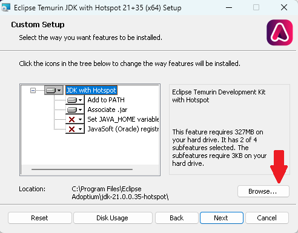
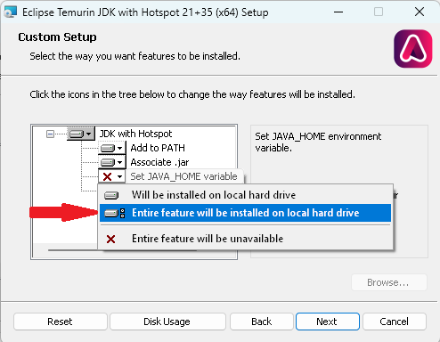

# Setting up Java environment

## Java Development Kit

::::{tab-set}
:sync-group: os

:::{tab-item} Windows
:sync: win

There are many JDKs (Java Development Kits) available online but [Temurin](https://adoptium.net/) is a great option. Choose [Temurin JDK 21 LTS (use the `.msi` installer)](https://adoptium.net/temurin/releases/?package=jdk&version=21&os=windows&arch=x64).

Open the `.msi` installer, agree to the license, and when you get to this page:


Go to **Set JAVA_HOME variable**, click on the little icon, and set that to "Entire feature will be installed on local hard drive":


Then, continue to follow the instructions and install it.
:::

:::{tab-item} Linux
:sync: linux

Your distribution should have a JDK available to download. If you're on Debian, Ubuntu, Mint, or some other `apt`-based distribution, you can install the system-recommended JDK using
```bash
sudo apt install default-jdk
```

If you're on openSUSE:
```bash
sudo zypper in java-21-openjdk java-21-openjdk-devel
```

Ask an upperclassman if you need help
:::

:::{tab-item} macOS
:sync: macos

There are many JDKs (Java Development Kits) available online but [Temurin](https://adoptium.net/) is a great option. Choose [Temurin JDK 21 LTS (use the `.pkg` installer)](https://adoptium.net/temurin/releases/?package=jdk&version=21&os=mac&arch=any).
:::

::::

## Visual Studio Code (VSCode)

Download it from [the website](https://code.visualstudio.com/).

Remember to [disable the AI features](disable-ai.md).
