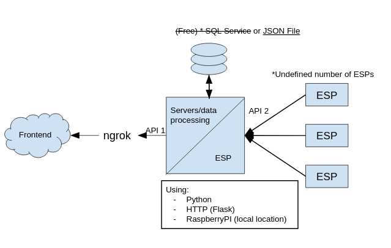

# Lexington Traffic Project

See how long the line is at Lexington, using beambreakers and microcontrollers (ESP32s).

```{button-link} https://github.com/epochml/LexingtonTraffic
:color: secondary
:shadow:

GitHub repository
```



## Progress

* Part of the frontend is finished
* Design and part of the embedded code is done

## Goals

* Finish the beambreaker and ESP32 code
* Finish the frontend
* Improve the database
* Migrate hosting to the cluster
